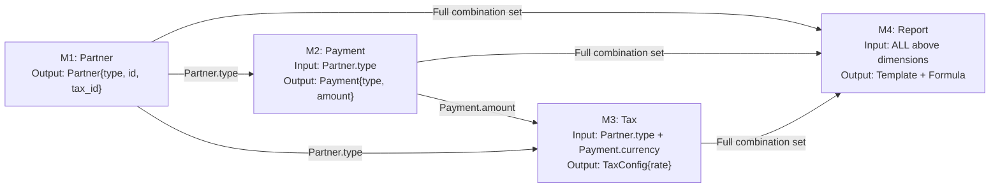

# /generate_cross_module_test_plan — Cross-Module Analysis & Combinatorial Matrix Generation

> **Use case:** This workflow is designed for complex features that span across **multiple sequential modules** (e.g., Module 1 → Module 2 → Module 3 → Final Report). Each module has multiple options (dimensions), and the specific combination of these options determines the final business output, such as different document templates, calculation formulas, or specialized business rules.

> **MANDATORY PRE-REQUISITES:** Before initiating this workflow, you MUST load and carefully review the following skill definitions to ensure compliance with project standards:
> - **Skill:** `.agent/skills/qa_automation_engineer/SKILL.md` — For workflow routing and general automation rules.
> - **Skill:** `.agent/skills/requirements_analyzer/SKILL.md` — For accurate requirement extraction from the UI.
> - **Skill:** `.agent/skills/ui_debug_agent/SKILL.md` — For inspecting the actual DOM and UI hierarchy.
> - **Skill:** `.agent/skills/test_data_generator/SKILL.md` — For rules on generating structured test data (refer to the Multi-Step Pipeline section).

---

## When to Use This Workflow?

| Situation | Use this workflow? | Rationale |
|------------|-------------------|-----------|
| Feature resides in **1 module or form** | ❌ NO | Use `/generate_manual_testcases_rbt` instead. |
| Feature spans **multiple independent modules** | ⚠️ MAYBE | `/generate_application_test_plan` is usually sufficient unless dependencies are complex. |
| Feature spans **multiple SEQUENTIAL modules** | ✅ **YES** | The output depends on the unique combination of inputs across the chain. |
| Need a **combinatorial matrix** | ✅ **YES** | Required for Pairwise, Business-critical, or Full Cartesian coverage. |

**Real-world Business Examples:**
- **Partner Payment Report:** Requires selecting Partner Type, then Payment Type, then configuring Tax and Debt settings, leading to different report templates.
- **Insurance Contract:** Depends on Insurance Type, Object (Person/Asset), Package Level, Term length, and Payment method.
- **Export Order Flow:** Market destination × Commodity type × Shipping method × Payment terms × Required documents.
- **Approval Workflow:** Request type × Department × Management Level × Transaction Amount.

---

## Required User Input

To ensure high-quality analysis, please provide as much of the following information as possible:

| Input Field | Mandatory | Description |
|-------|----------|-------|
| **Feature / Flow Name** | ✅ YES | e.g., "Partner Payment Report Generation Flow". |
| **Application URL** | ⚠️ REC | Highly recommended for the agent to inspect the live DOM and verify fields. |
| **Participating Modules** | ⚠️ REC | List of modules in the sequence. Agent can explore autonomously if not provided. |
| **Dimensions List** | ⚠️ REC | The primary axes for the matrix (e.g., Partner Type, Tax Type, Currency). |
| **Business Rules / Formulas** | ❌ OPT | If available, the agent will map these to the matrix; otherwise, it will detect them via UI. |
| **Credentials** | ❌ OPT | Necessary if the application requires authentication to access the modules. |
| **Matrix Strategy** | ❌ OPT | Choose between `pairwise` (default), `business-critical`, or `full-cartesian`. |

---

## Execution Steps

### Step 1: Multi-Module Recon — Explore Each Module (BROWSER REQUIRED)

> ⚡ **CRITICAL RULE:** The agent MUST use MCP browser tools to inspect the actual live DOM. **ABSOLUTELY DO NOT GUESS** field names, types, or values based on documentation alone.

1. **For each module** in the sequential chain, the agent performs:
   `browser_navigate` → `browser_resize (1920x1080)` → `browser_wait_for (load)` → `browser_snapshot`.

2. **Data Collection Per Module:**
| Information | How to Obtain | Example |
|-----------|----------|-------|
| **Module Name** | Page title, breadcrumbs, or header | "Partner Management" |
| **Fields / Controls** | DOM Snapshot → analyze inputs, selects, radios | "Partner Type" dropdown |
| **Selectable Values** | Click to open dropdowns → read all options | `["Organization", "Individual", "Business"]` |
| **Validation Rules** | Check required flags, format masks, limits | "Tax ID: required, 10-13 numeric digits" |
| **Output / Result** | Data objects generated or modified | "Partner ID, Name, Type, Tax ID" |
| **Trigger for Next** | Buttons, links, or automatic redirects | "Click 'Create Payment' → Proceed to Payment" |

3. **Record in Module Inventory Table:**
| # | Module Name | URL / Path | Inputs Collected | Key Dimensions | Primary Output | → Next Module |
|---|-------------|------------|------------------|----------------|----------------|---------------|
| 1 | Partner Mgr | /partners | Name, Tax ID, Type| **Partner Type** | Partner ID | → Payment |
| 2 | Payment New | /payments/new| Amount, Currency | **Payment Type** | Payment ID | → Tax Config |
| 3 | Tax Config  | /tax-config | Tax Type, Rate   | **Tax Type**    | Tax Config ID | → Report Gen |

---

### Step 2: Data Flow Mapping — Visualize Flow (CHECKPOINT ⏸️)

1. **Identify Data Dependencies:** Determine how the output of Module A (e.g., Partner Type) dictates the available options or logic in Module B.
2. **Draw Data Flow Diagram using Mermaid:**

3. **Define Dependencies Matrix:**
| Target Module | Depends On | Dependent Field | Dependency Type |
|-------------|--------------|-----------------|----------------|
| Payment | Partner | Partner.type | Filters available payment methods |
| Tax | Partner + Payment | Partner.type, Payment.currency | Determines applicable tax rate |
| Report | All Modules | All Dimensions | Determines final template + formula |

4. **⏸️ STOP — Present the Diagram and Matrix to the user.** **You MUST wait for user confirmation** that the flow is correct before proceeding to Step 3.

---

### Step 3: Dimension Extraction — List Combinatorial Axes

1. **Extract "Dimensions"** (the independent variables that drive the business logic):
| # | Dimension Name | Source Module | Possible Values / Options | Count |
|---|----------------|---------------|---------------------------|-------|
| D1 | Partner Type | Partner | Organization, Individual, Household | 3 |
| D2 | Payment Type | Payment | VND (Local), USD (Foreign) | 2 |
| D3 | Tax Type | Tax | PIT, VAT, Contractor, Exempt | 4 |
| D4 | Debt Type | Debt | Normal, Advance, Adjustment | 3 |

2. **Identify Constraints & Invalid Combinations:**
| Constraint ID | Logical Constraint Description | Exclusion Set |
|---------------|--------------------------------|---------------|
| C1 | Individual + USD → Contractor tax is not applicable in this system | 1 combination |
| C2 | Household + Exempt → This combination is non-existent in business rules | 2 combinations |

3. **Calculate Total Potential Combinations:** e.g., 3 × 2 × 4 × 3 = 72 total combinations.

---

### Step 4: Generate Combinatorial Matrix (CORE OUTPUT ⭐)

The agent supports **three strategies** for matrix generation:

#### 4A. Pairwise Testing (Default — RECOMMENDED)
Ensures every **pair of two values** from any two dimensions is tested at least once. This strategy is highly effective at finding bugs while reducing a massive combination set (e.g., 500 sets) down to a manageable size (e.g., 40 sets).
- **Algorithm:** Uses IPOG (In-Parameter-Order-General) or a greedy coverage approach.
- If dimensions are manageable (≤ 6), the agent will calculate the pairwise set automatically.

#### 4B. Business-Critical Only
Selects 8-15 specific combinations based on business risk and practical usage:
- Most common "Happy Path" combinations used by real users.
- High-risk financial or tax-heavy paths where errors are costly.
- Boundary edge cases between different types.

#### 4C. Full Cartesian (Complete)
Tests ALL valid combinations. Recommended only if the total number of sets is ≤ 50 or if the user explicitly requires 100% mathematical coverage.

**Matrix Table Output Example:**
| # | D1: Partner | D2: Payment | D3: Tax | D4: Debt | → Expected Template | → Expected Formula | Priority |
|---|------------|-------------|---------|----------|---------------------|--------------------|----------|
| 1 | Organization| VND         | VAT 10% | Normal   | BB_TC_VND_VAT       | Base Amount × 1.10 | High     |
| 2 | Organization| USD         | PIT 10% | Advance  | BB_TC_USD_PIT       | (Amount × Rate) × 0.90 | High |
| 3 | Individual  | VND         | PIT 10% | Normal   | BB_CN_VND_PIT       | Base Amount × 0.90 | High     |
| 4 | Individual  | USD         | VAT 10% | Adjustment| BB_CN_USD_VAT      | (Amount × Rate) × 1.10 | Medium   |

---

### Step 5: Expected Output Mapping & Delivery (CHECKPOINT ⏸️)

1. **For each combination in the generated matrix**, the agent defines:
   - **Expected Template:** The specific report or document format to be used.
   - **Expected Formula:** The exact mathematical logic for calculations.
   - **Expected Fields:** Which UI elements or data points must be displayed.
   - **Test Priority:** P1 to P4 based on business risk and usage frequency.

2. **Generate Final Output Artifacts:**
   - `cross_module_test_plan_<feature>.md`: Contains the full analysis, Mermaid diagrams, and the Matrix.
   - `combinatorial_matrix_<feature>.md`: A standalone, clean matrix table for easy import into Jira, Xray, or Excel.

3. **⏸️ STOP — Present the complete Matrix to the User.** **Wait for final approval** before proceeding to automation or manual test case writing.

---

## Next Steps
- **Generate Detailed TCs:** Use `/generate_manual_testcases_rbt` with the matrix as input.
- **Generate Test Data:** Use `/generate_combinatorial_test_data` for live pipeline data creation.
- **Automate Scripts:** Use `/generate_automation_from_testcases` once TCs are ready.

## Rules & Quality Standards

| ❌ Forbidden Action | ✅ Correct Alternative |
|-------------------|-----------------|
| Guessing UI elements without browser inspection | Always use MCP tools to inspect the real, live DOM. |
| Deciding formulas without user verification | Ask the user to confirm formulas or check business docs. |
| Ignoring invalid business constraints | Actively identify and exclude logical impossibilities. |
| Skipping mandatory sequential checkpoints | You MUST stop at Step 2 and Step 5 for user feedback. |
| Hardcoding test data in the matrix | Use dynamic, traceable data placeholders. |

---

## Final Review Checklist
- [ ] Inspected the actual DOM for ALL participating modules in the chain.
- [ ] User has confirmed the Data Flow Diagram and Dependencies at Step 2.
- [ ] Successfully extracted all dimensions, values, and logical constraints.
- [ ] Selected the most appropriate matrix strategy (Pairwise / Full / Risk-based).
- [ ] The Matrix includes clear "Expected Template" and "Expected Formula" columns.
- [ ] User has provided final confirmation of the matrix at Step 5.
- [ ] All output artifacts are saved in the designated project directories.